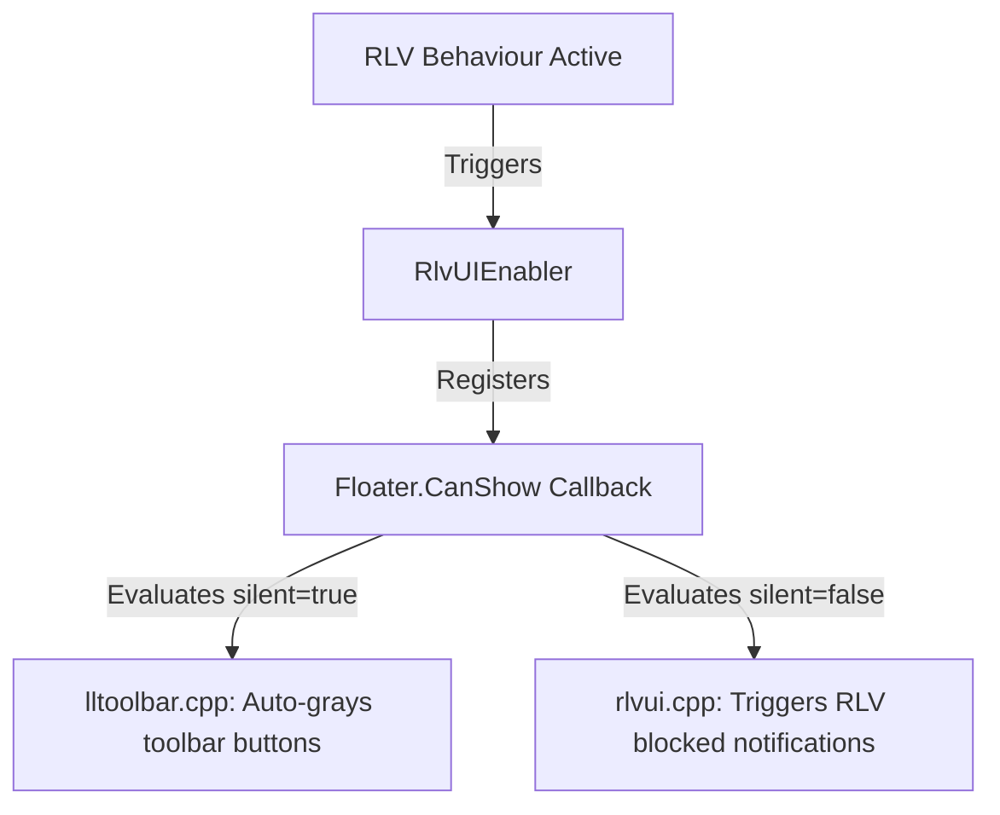
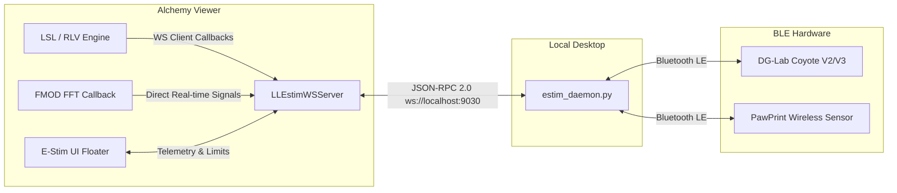

# Alchemy Viewer: Custom Features Documentation

This document describes the design, architecture, and behavior of custom features integrated into this build of the Alchemy Viewer. These features focus on safety-critical enhancements, UI modernization for Restricted Love (RLV), and native haptic telemetry integration.

---

## 1. RLV Startup Screen Lock

### Goal
Prevent players from catching a brief glimpse of their environment or interacting with the interface before RLV restrictions (e.g., blind folds, location blocks, UI restrictions) have finished loading from attachments during login or teleport.

### Implementation Details
- **In-World Lock Overlay:** To avoid stalling the login queue and triggering 'Clothes are still loading' warnings, the viewer completes the startup state machine and transitions to `STATE_STARTED` to spawn the agent in-world immediately. Instead of holding the splash screen, it draws a full-screen solid black overlay displaying `"Initializing RLV restrictions..."` directly on top of the 2D UI render path, and intercepts all keyboard/mouse inputs and UI hover updates. This allows simulator packets, attachment rezzing, and RLV script command parsing to start executing instantly in the background while keeping the user interface completely locked down.
- **Dynamic Lock Release:** Release criteria is controlled via four custom settings:
  - `RLVStartupLock` (Boolean): Enables/disables the feature. Default: `true`.
  - `RLVStartupLockMinDelay` (F32): Minimum hold time in seconds. Default: `5.0`s.
  - `RLVStartupLockQuietPeriod` (F32): Lock remains engaged until no new RLV commands are received for this duration. Default: `2.0`s.
  - `RLVStartupLockTimeout` (F32): Absolute maximum fallback timeout. Default: `15.0`s.

---

## 2. Visual UI Locked States (Natively Grayed-Out UI)

### Goal
Rather than letting the user click restricted buttons/menus and triggering pop-up errors ("Blocked by RLV"), the viewer natively disables and grays out target UI elements when restrictions are active.



### Covered Restrictions
The following standard RLV commands map to visual UI disabling states:
- `@showsearch=n` &rarr; Disables **Search** toolbar icon, search shortcuts, and `search` floater.
- `@showfriends=n` &rarr; Disables the **Friends** and **Recent** tabs on the People panel, and clears their lists.
- `@showdevelop=n` &rarr; Disables and completely hides the **Advanced** and **Developer** top menu bars.
- `@showconversation=n` &rarr; Disables nearby chat toolbar icons, active IM containers, and chat history.
- `@showoutfits=n` &rarr; Disables Appearance/Outfits floater, and Avatar menus (e.g., "Now wearing...", "My outfits...", "Hover height...", "Edit shape...").
- `@showbuild=n` &rarr; Disables Build/Edit floaters and context menus. Blocks editing shortcuts (Ctrl+1, Ctrl+B) and pie/context menus.
- `@showdestinations=n` &rarr; Disables destinations guide button and panel.
- `@showcamera=n` &rarr; Disables camera controls, presets buttons, and presets panels.
- `@showpreferences=n` &rarr; Disables the Preferences menu option and preferences shortcut.

### Technical Architecture
1. **Automatic Toolbar Gray-out:** Updated [lltoolbar.cpp](file:///C:/Users/Matti/Documents/antigravity/excited-turing/Alchemy/indra/llui/lltoolbar.cpp#L1091-L1114) to automatically map toolbar button enablers to `Floater.CanShow` callbacks if they represent floater commands.
2. **Background Check Silence:** Modified [llui.cpp](file:///C:/Users/Matti/Documents/antigravity/excited-turing/Alchemy/indra/llui/llui.cpp#L193-L197) to pass `silent = true` to `canShowInstance` checks. This allows the UI engine to query if a button should be enabled without popping up intrusive onscreen notification tips.
3. **Menu & Shortcut Hardening:** In [llviewermenu.cpp](file:///C:/Users/Matti/Documents/antigravity/excited-turing/Alchemy/indra/newview/llviewermenu.cpp) and [lltoolmgr.cpp](file:///C:/Users/Matti/Documents/antigravity/excited-turing/Alchemy/indra/newview/lltoolmgr.cpp#L280-L287), C++ handlers (like `LLToolsSelectTool` and `LLEditEnableCustomizeAvatar`) check the active `gRlvHandler` behaviors directly, overriding attempts to bypass constraints via context menus or keyboard shortcuts.

---

## 3. Contact Lists & Profiles Blocking

### Behavior & Effects
Enforces contact blocking to prevent communication or social networking under restraint.
- **Social Panel Restrictions (`@showfriends=n`)**: Inside [llpanelpeople.cpp](file:///C:/Users/Matti/Documents/antigravity/excited-turing/Alchemy/indra/newview/llpanelpeople.cpp):
  - Online/offline Friends lists and Recent Contacts lists are completely cleared and updates are bypassed.
  - The "Friends" and "Recent" tabs on the panel are disabled and grayed out.
  - Help text is replaced by `"Unable to see friends due to RLV restrictions"`.
- **Profile Interception (`@showprofiles=n`)**: Dynamically registers floater and panel filters for `"profile"`, `"web_profile"`, and `"legacy_profile"`. Attempts to view other residents' Profiles are blocked and trigger an `RLVProfileBlocked` notification (own profile remains readable).
- **Communication Flow**: Users are NOT restricted from initiating or participating in IM sessions. This allows isolated communication without broad list visibility.

---

## 4. Cleaner Shutdown (`@shutdown`)

### Syntax
- `@shutdown[:seconds]=force`

### Behavior
- Initiates a clean viewer shutdown.
- Launches a ticker timer, alerts the user with `RLVShutdownCountdown`, and calls `LLAppViewer::instance()->requestQuit()` at zero.
- If no argument is passed (or parsing fails), it defaults to a **10-second** countdown.

---

## 5. Native E-Stim & Telemetry Integration

A complete, high-performance integration featuring direct WebSocket communication, FMOD Audio-to-Estim sync, and a sensor-driven Trigger Engine.

### 5.1 Architecture Overview

The system bypasses intermediate in-world collar relays, communicating directly with device APIs:



- **Companion Daemon:** A Python BLE bridge (`scripts/estim_daemon.py`) that handles pairing, BLE connection keep-alives, and command mapping.
- **WebSocket Server:** [LLEstimWSServer](file:///C:/Users/Matti/Documents/antigravity/excited-turing/Alchemy/indra/newview/llestimwsmgr.h#L50-L136) runs natively in the viewer, binding to `EstimWebsocketPort` (default `9030`).

---

### 5.2 RLV Command API Reference

Creators can control e-stim states using standard RLV force commands (`@estim_<command>[:<options>]=force`).

> [!WARNING]
> Because Second Life's local chat box includes an aggressive HTML filter, typing rules containing `<` directly into chat will cause them to be deleted. **Always use LSL scripts (`llOwnerSay`) to add trigger rules.**

| RLV Command | Arguments / Format | Behavior |
| :--- | :--- | :--- |
| **Intensity** | `@estim_intensity:<channel>:<0-100>` | Sets channel intensity. Capped by hardware caps and user settings. |
| **Shock** | `@estim_shock:<channel>:<intensity>:<hz>:<ms>` | Executes a precise timed pulse immune to script lag. Overlapping shocks play in sequence. |
| **Frequency** | `@estim_freq:<channel>:<hz>` | Sets stimulation frequency (in Hz). |
| **Pulse Width** | `@estim_pulse_width:<channel>:<width>` | Adjusts pulse width metric. |
| **Waveform** | `@estim_waveform:<channel>:<name>` | Changes waveform style (e.g. sine, square, triangle). |
| **Pattern** | `@estim_pattern:<channel>:<id>` | Triggers a built-in wave pattern macro. |
| **Audio Sync** | `@estim_audio_sync:<on\|off>` | Enables/disables FMOD audio spectrum mapping. |
| **Panic Stop** | `@estim_stop` | Safety cut-off: immediately stops all channels. |
| **Trigger Rules** | `@estim_trigger:<add\|clear>[:rules]` | Configures sensor-based macros (see Section 5.3). |
| **Telemetry Stream**| `@estim_notify:<sensor>:<axis>:<chat_chan>=n\|y` | Subscribes (`=n`) or unsubscribes (`=y`) LSL to changes. |
| **Query Value** | `@estim_getval:<sensor>:<axis>=<chat_chan>` | Queries a single sensor value. Replies on `<chat_chan>`. |

*Fields:*
- `<channel>`: `a` (Channel A), `b` (Channel B)
- `<sensor>`: `paw` (PawPrint wireless sensor)
- `<axis>`: `button` (0/1), `accel` (0-255), `x` (0-255), `y` (0-255), `z` (0-255)

---

### 5.3 Sensor Trigger Engine

The trigger engine evaluates incoming sensor data (like PawPrint rotation or acceleration) locally inside the viewer and fires mapped commands immediately, avoiding simulator lag.

- **Edge-Triggered Execution:** Trigger rules are evaluated on every sensor frame, but their actions are fired exactly once on transition from `False` to `True`. The state resets when the condition returns to `False`. This prevents saturation of the BLE connection and LSL script queues.
- **Add Trigger Syntax:**
  `@estim_trigger:add:<sensor>:<axis>:<operator>:<threshold>:<action>=force`
  - `<operator>`: `>`, `<`, `==`
  - `<action>`: Mapped action in form `<type>:<channel>:<value>`. Valid types: `intensity`, `freq`, `pattern`, or `lsl` (fires a chat message to a specific in-world channel).
- **Clear Triggers Syntax:**
  `@estim_trigger:clear=force`

**LSL Registration Example:**
```lsl
default
{
    state_entry()
    {
        // Set Channel A intensity to 50 if the PawPrint tilts beyond threshold (Y-axis > 45)
        llOwnerSay("@estim_trigger:add:paw:y:>:45:intensity:a:50=force");
        
        // Return Channel A to 0 if the PawPrint tilts back down (Y-axis < 45)
        llOwnerSay("@estim_trigger:add:paw:y:<:45:intensity:a:0=force");
        
        // Send a custom chat string back on channel 555 when the sensor button is pressed
        llOwnerSay("@estim_trigger:add:paw:button:==:1:lsl:555:paw_clicked=force");
    }
}
```

---

### 5.4 Audio Sync (FFT Analyzer Integration)
By hooking into FMOD Studio's DSP pipeline ([llaudioengine_fmodstudio.cpp](file:///C:/Users/Matti/Documents/antigravity/excited-turing/Alchemy/indra/llaudio/llaudioengine_fmodstudio.cpp#L168-L180)), the viewer can parse real-time frequency data:
- **Processing Bins:** Captures 128 audio bins at 50ms intervals.
- **Mapping Algorithm:**
  - **Bass (low frequencies):** Extracted from the first 10 bins, mapped directly to **Channel A Intensity** (`0` to `100`).
  - **Mid-High (vocal/ambient frequencies):** Extracted from middle bins, mapped to **Channel B Frequency** (`10Hz` to `150Hz`).

---

### 5.5 Safety & Telemetry Systems
- **Hard Intensity Cap:** Enforced via `EstimMaxIntensityCap` in settings. No script, sync, or trigger rule can exceed this limit.
- **Electrode Load Detection:** If skin contact is broken, the Coyote hardware signals a load disconnect. The daemon detects this and sets outputs to 0 immediately, raising the `EstimLoadDisconnect` notification tip.
- **Battery Monitoring:** Tracks battery levels for Coyote and sensors. Low battery triggers `EstimLowBattery` notification tips when capacity drops below 10%.
- **Emergency Shortcut:** Keyboard shortcut **Ctrl + Shift + P** instantly calls the panic stop function, dropping all channels.
- **E-Stim UI Floater:** Accessible via `Me` &rarr; `E-Stim UI` (or `EstimUI` command). Displays connection status, battery percentages, electrode load states, active trigger lists, a dynamic scroll list of **Connected Sensors** showing live telemetry values (Button, Accel, X, Y, Z), and a giant **PANIC STOP** button.

---

### 5.6 WebSocket API Reference

The native WebSocket server communicates with connected clients (e.g. `estim_daemon.py`) using JSON-RPC 2.0.

#### Methods
- `get_triggers`: Requests the list of all currently active trigger rules.
  - *Returns:* Array of maps containing rule configuration:
    ```json
    [
      {
        "sensor": "paw",
        "axis": "y",
        "operator": ">",
        "threshold": 45.0,
        "rule_action": "intensity:a:50"
      }
    ]
    ```

#### Broadcast Notifications
The server broadcasts the following JSON-RPC notifications to all connected clients:
- `sensor_update`: Fired when a sensor value changes.
  - *Parameters:* `{"sensor": "<name>", "axis": "<name>", "value": <float>}`
- `telemetry`: Fired on battery status or load state updates.
  - *Parameters:* `{"battery": <float>, "load_a": <bool>, "load_b": <bool>}` (or equivalents)
- `trigger_update`: Fired when triggers are added or cleared.
  - *Parameters:*
    - On add: `{"action": "add", "sensor": "<name>", "axis": "<name>", "operator": "<op>", "threshold": <float>, "rule_action": "<action>"}`
    - On clear: `{"action": "clear"}`

---

### 5.7 3D Gizmo Visualizer (`pawprint_gizmo.py`)

A standalone Python desktop application included in the `scripts/` directory that provides real-time 3D telemetry visualization.

#### Features
- **Real-Time 3D Orientation**: Projects a rotating 3D rectangular prism (using math and Tkinter) that accurately reflects the PawPrint sensor's current pitch, roll, and yaw angles via the WebSocket telemetry stream.
- **Native Gravity Vector Mapping**: Automatically computes absolute Pitch and Roll Euler angles by extracting the gravity vector from the raw hardware accelerometer data, making it immune to gimbal lock or inverted physical chip mountings.
- **Dynamic Indicators**: Features a visual progress bar that fills proportionally based on sensor acceleration, and a light indicator that illuminates when the sensor button is pressed.
- **Constraint Safe Areas**: Automatically reads active trigger rules from the WebSocket server (using `get_triggers` and `trigger_update` broadcasts) and renders them as visual bounds in the 3D space, providing a visual "safe area" that the paw orientation should not cross.

---

## 6. Edit All Scripts in External Editor

### Goal
Provide a way to open all script assets inside an object's task inventory at once in the configured external editor, avoiding the tedious process of double-clicking and clicking "Edit" (External) on each script manually.

### Behavior & Effects
- **UI Control:** Adds a new **Edit All** button to the **Content** tab in the build/tools floater, placed between the "New Script" flyout button and the "Permissions" button.
- **Dynamic States:** The button is only enabled when:
  - The selection is a single object (either 1 root or 1 child).
  - The object is editable.
  - The object's task inventory contains at least one LSL script asset.
- **Background Orchestration:** When clicked, the viewer:
  1. Instantiates a `LLLiveLSLEditor` floater instance for each script in the object in the background.
  2. Passes the `open_external` flag.
  3. Minimizes the internal editor floaters immediately (`setMinimized(true)`) to maintain an uncluttered workspace.
  4. Automatically writes the content of each script to a temporary file in the local Temp directory (prefixed with `sl_script_`) and launches the external editor (using `LLExternalEditor`).
  5. The viewer's file watcher continuously monitors each temp file for changes, automatically compiling and uploading the new bytecode to Second Life when any of the files are saved.
